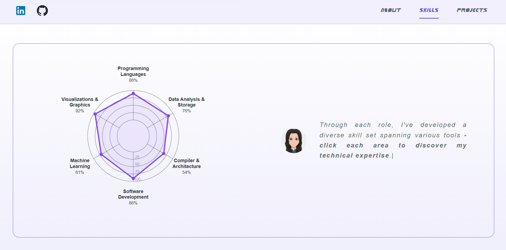

# 🚀 Interactive Personal Portfolio

> A modern, responsive portfolio website showcasing my journey as a software developer and data visualization specialist.

[](https://yingchengchen.github.io/Portfolio/)

[](https://www.linkedin.com/in/ying-cheng-chen/)

[](https://github.com/yingchengchen)


## ✨ Features

- Interactive Radar Chart - Dynamic skills visualization with hover effects and responsive design

- Responsive Design - Optimized for all devices from mobile to desktop

- Modern UI/UX - Clean, professional design with smooth animations

- Performance Optimized - Fast loading times and smooth interactions

- Accessibility Focused - WCAG compliant with proper ARIA labels

## 🛠️ Tech Stack

### Frontend

- React - Component-based UI library

- Material-UI (MUI) - Modern React component library

- D3.js - Data-driven visualizations

- Styled-Components - CSS-in-JS styling solution

### Tools & Libraries

- React Typed - Typing animation effects

- Intersection Observer API - Scroll-triggered animations

- Responsive Design - Mobile-first approach

### Development

- Create React App - React application setup

- ES6+ - Modern JavaScript features

- CSS Grid & Flexbox - Advanced layout techniques

## 🎯 Sections

### 👨‍💻 About

Personal introduction with professional background and journey. Click each role card to discover the story behind each experience.

<div style="display: flex; ">
  
  
</div>

### 🔧 Skills

Interactive radar chart showcasing technical expertise across multiple domains. Hover over skill labels to see detailed technologies:

- Programming Languages - JavaScript, Python, C/C++, HTML/CSS, R, PHP
- Data Analysis & Storage - SQL, MongoDB, AWS, PostgreSQL, Excel VBA
- Machine Learning - LLM, TensorFlow, PyTorch, Scikit-learn
- Software Development - Vue, React, Svelte, Node.js, Flask
- Visualizations & Graphics - D3.js, Matplotlib, Seaborn, Leaflet, Figma
- Compiler & Architecture - lex&yacc, gem5, SIC/XE

<div style="display: flex; ">
  
  
</div>

### 📂 Projects

Showcase of selected projects with live demos and source code. Each project card expands to reveal comprehensive details and technical specifications.


## 📱 Responsive Design

The portfolio is fully responsive and optimized for:

- 📱 Mobile devices (320px+)

- 📱 Tablets (768px+)

- 💻 Laptops (1024px+)

- 🖥️ Desktops (1200px+)

## 🎨 Design Philosophy

- Minimalist - Clean, distraction-free design

- Professional - Business-appropriate color scheme and typography

- Interactive - Engaging user experience with smooth animations

- Accessible - Inclusive design for all users

## 📈 Performance

- Lighthouse Score: 95+ across all metrics

- Load Time: < 3 seconds on 3G

- Bundle Size: Optimized and code-split

- Accessibility: WCAG 2.1 AA compliant

## 🙏 Acknowledgments

- Design inspiration from modern portfolio trends

- Icons by [Material-UI Icons](https://mui.com/material-ui/material-icons/)

- Fonts from [Google Fonts](https://fonts.google.com/)

- Special thanks to the open-source community

## 🚀 Getting Started

### Prerequisites

- Node.js (v14 or higher)

- npm or yarn

### Installation

1. Clone the repository

   ```bash

   git clone https://github.com/yingchengchen/portfolio.git

   cd portfolio

   ```

2. Install dependencies

   ```bash

   npm install

   # or

   yarn install

   ```

3. Start the development server

   ```bash

   npm start

   # or

   yarn start

   ```

4. Open your browser

   Navigate to http://localhost:3000

### Building for Production

```bash

npm run build

# or

yarn build

```

---

⭐ If you like this project, please give it a star! ⭐

Built with ❤️ and lots of ☕
